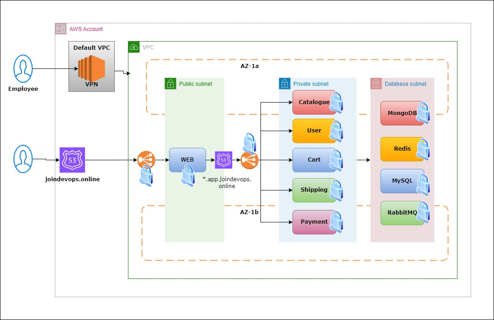
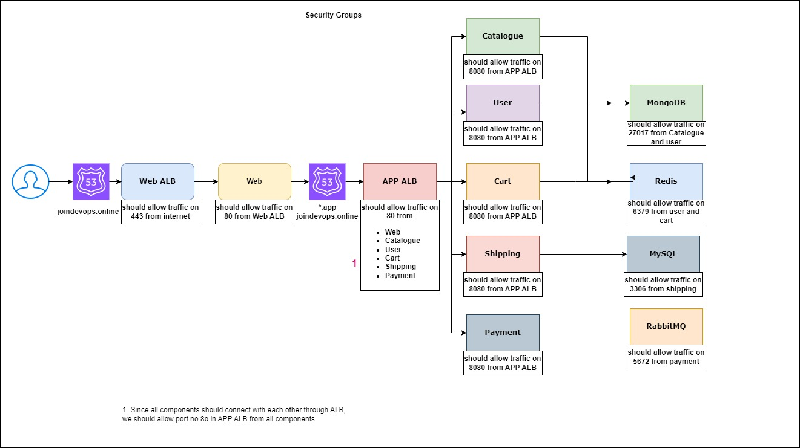

# How to remove unnecessary files:
```
for d in 01-vpc/ 02-sg/ 03-bastion/ 04-mysql/ 05-mongodb/ 06-redis/ 07-rabbitmq/ 08-catalogue/ 09-cart/ 10-user/ 11-shipping/ 12-payment/ 13-web/ 14-dispatch/ ; do
  echo "Removing from $d:"
  echo "  $d/.terraform"
  echo "  $d/.terraform.lock.hcl"

  rm -rf "$d/.terraform" "$d/.terraform.lock.hcl"

  echo "Deleted files from $d"
done
```

```
for i in 01-vpc/ 02-sg/ 03-bastion/ 04-mysql/ 05-mongodb/ 06-redis/ 07-rabbitmq/ 08-catalogue/ 09-cart/ 10-user/ 11-shipping/ 12-payment/ 13-web/ 14-dispatch/ ; do cd $i; terraform init ; cd .. ; done 
```

```
for i in 01-vpc/ 02-sg/ 03-bastion/ 04-mysql/ 05-mongodb/ 06-redis/ 07-rabbitmq/ 08-catalogue/ 09-cart/ 10-user/ 11-shipping/ 12-payment/ 13-web/ 14-dispatch/ ; do cd $i; terraform plan; cd .. ; done 
```

```
for i in 01-vpc/ 02-sg/ 03-bastion/ 04-mysql/ 05-mongodb/ 06-redis/ 07-rabbitmq/ 08-catalogue/ 09-cart/ 10-user/ 11-shipping/ 12-payment/ 13-web/ 14-dispatch/ ; do cd $i; terraform apply -auto-approve; cd .. ; done 
```

```
for i in   14-dispatch/ 13-web/ 12-payment/ 11-shipping/ 10-user/ 09-cart/  08-catalogue/ 07-rabbitmq/ 06-redis/ 05-mongodb/ 04-mysql/  03-bastion/ 02-sg/ 01-vpc/  ; do cd $i; terraform destroy -auto-approve; cd .. ; done 
```




